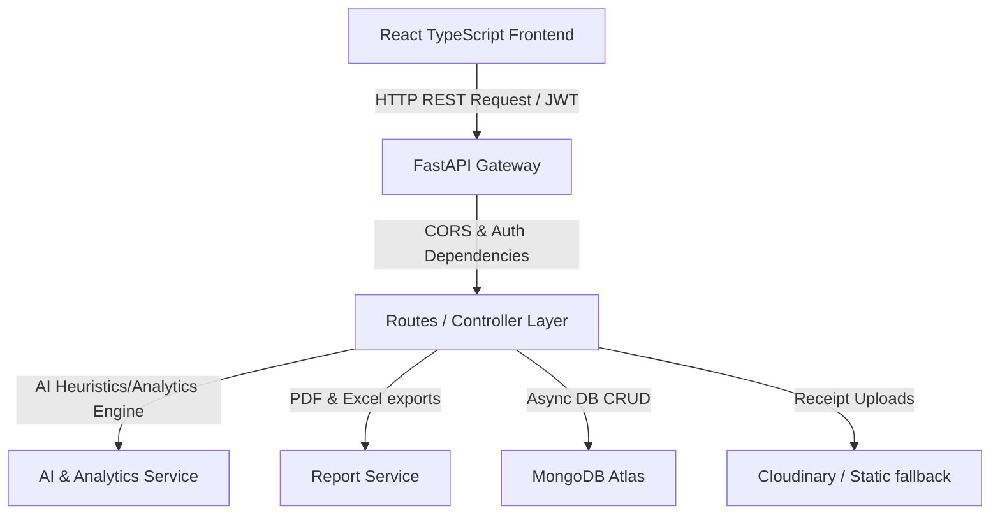
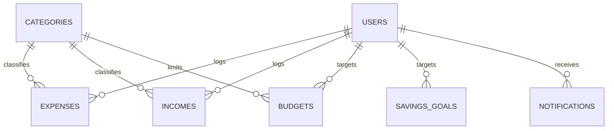

# Smart Expense Analyzer

The **Smart Expense Analyzer** is an intelligent, high-performance personal finance and expense management platform designed for students, employees, freelancers, families, and small business owners. It features secure user registration/login, automated rule-based categorization, interactive dashboard summaries, spend forecasts, transaction anomaly alerts, custom budgets, PDF statements, and backup controls.

---

## Technical Stack

* **Frontend**: React (TypeScript), Vite, Tailwind CSS, Framer Motion, Chart.js, Axios, React Router.
* **Backend**: Python FastAPI, Uvicorn, Pydantic validation, Passlib, JWT auth, Pandas, ReportLab, OpenPyXL.
* **Database**: MongoDB (via Motor async driver).
* **Storage**: Cloudinary (with local disk static backup fallback).

---

## System Architecture



### Database Entity Relationship Model



---

## Directory Structure

```text
├── backend
│   ├── app
│   │   ├── main.py             # Server entry point
│   │   ├── config.py           # App settings & env
│   │   ├── database.py         # Mongo connection & seeding
│   │   ├── middlewares
│   │   │   └── auth_middleware.py
│   │   ├── models
│   │   │   ├── base.py
│   │   │   ├── user.py
│   │   │   ├── category.py
│   │   │   ├── transaction.py
│   │   │   ├── budget.py
│   │   │   ├── savings_goal.py
│   │   │   ├── notification.py
│   │   │   └── settings.py
│   │   ├── routes
│   │   │   ├── auth.py
│   │   │   ├── transactions.py
│   │   │   ├── category.py
│   │   │   ├── budgets.py
│   │   │   ├── dashboard.py
│   │   │   ├── analytics.py
│   │   │   ├── ai.py
│   │   │   ├── reports.py
│   │   │   └── notifications.py
│   │   └── services
│   │       ├── auth_service.py
│   │       ├── ai_service.py
│   │       ├── report_service.py
│   │       └── cloudinary_service.py
│   └── requirements.txt
└── frontend
    ├── src
    │   ├── App.tsx
    │   ├── main.tsx
    │   ├── index.css
    │   ├── components
    │   │   ├── Sidebar.tsx
    │   │   ├── Navbar.tsx
    │   │   ├── StatCard.tsx
    │   │   ├── TransactionModal.tsx
    │   │   ├── BudgetModal.tsx
    │   │   ├── CategoryModal.tsx
    │   │   └── SkeletonLoader.tsx
    │   ├── contexts
    │   │   ├── AuthContext.tsx
    │   │   └── ThemeContext.tsx
    │   ├── pages
    │   │   ├── Login.tsx
    │   │   ├── Register.tsx
    │   │   ├── Dashboard.tsx
    │   │   ├── Transactions.tsx
    │   │   ├── Budgets.tsx
    │   │   ├── Analytics.tsx
    │   │   ├── AIInsights.tsx
    │   │   ├── Reports.tsx
    │   │   └── Settings.tsx
    │   ├── types
    │   │   └── index.ts
    │   └── utils
    │       ├── api.ts
    │       └── formatters.ts
    ├── index.html
    ├── package.json
    ├── tailwind.config.js
    └── vite.config.ts
```

---

## API Endpoints List

| Endpoint | HTTP Method | Auth Required | Description |
| :--- | :--- | :--- | :--- |
| `/api/v1/auth/register` | `POST` | No | Registers new account profile and seeds settings |
| `/api/v1/auth/login` | `POST` | No | Checks credentials and returns JWT Bearer Token |
| `/api/v1/auth/me` | `GET` | Yes | Retrieves profile data for verified user |
| `/api/v1/transactions` | `POST` | Yes | Logs a new expense/income & alerts budget limits |
| `/api/v1/transactions` | `GET` | Yes | Returns paginated transactions with search filters |
| `/api/v1/transactions/import` | `POST` | Yes | Uploads and parses transaction records from CSV |
| `/api/v1/transactions/export` | `GET` | Yes | Streams all database ledger items in CSV format |
| `/api/v1/budgets` | `GET` | Yes | Compares monthly budget ceilings vs current spends |
| `/api/v1/budgets` | `POST` | Yes | Creates/Updates custom category budget caps |
| `/api/v1/budgets/goals` | `POST` | Yes | Creates a new savings target goal milestone |
| `/api/v1/dashboard` | `GET` | Yes | Returns net balance, recent records, and health indices |
| `/api/v1/analytics` | `GET` | Yes | Gathers data for cash flow, trend bars, and peak days |
| `/api/v1/ai/forecast-spending` | `GET` | Yes | Runs trend analysis to project next month's spending |
| `/api/v1/ai/anomalies` | `GET` | Yes | Evaluates and returns standard deviation overspends |
| `/api/v1/reports/export` | `GET` | Yes | Generates and downloads PDF statement or Excel sheet |

---

## Installation & Setup Guide

### Backend Configuration

1. **Prerequisites**: Install [Python 3.10+](https://www.python.org/downloads/) and [MongoDB](https://www.mongodb.com/try/download/community).
2. Navigate to `backend` directory.
3. Install dependencies:
   ```bash
   pip install -r requirements.txt
   ```
4. Create a `.env` file containing:
   ```env
   MONGODB_URI=mongodb://localhost:27017
   DATABASE_NAME=smart_expense_analyzer
   JWT_SECRET=super_secret_cryptographic_key_val
   CLOUDINARY_CLOUD_NAME=your_cloudinary_cloud_name
   CLOUDINARY_API_KEY=your_cloudinary_api_key
   CLOUDINARY_API_SECRET=your_cloudinary_api_secret
   ```
5. Launch FastAPI development server:
   ```bash
   uvicorn backend.app.main:app --reload
   ```

### Frontend Configuration

1. **Prerequisites**: Install [Node.js v18+](https://nodejs.org/).
2. Navigate to `frontend` directory.
3. Install package configurations:
   ```bash
   npm install
   ```
4. Start Vite local server:
   ```bash
   npm run dev
   ```
5. Open [http://localhost:3000](http://localhost:3000) to view the Smart Expense Analyzer app dashboard.
