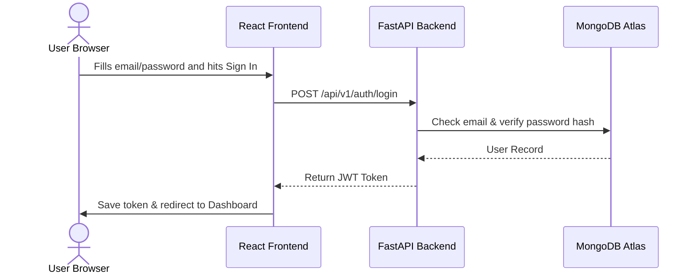

# budgetIQ — Smart Expense Analyzer

**budgetIQ** (formerly Smart Expense Analyzer) is a next-generation personal finance and expense management platform designed for students, employees, freelancers, families, and small business owners. 

The application utilizes real-time AI spending analytics to help users gain financial control, offering automated rule-based categorization, interactive dashboard summaries, spend forecasting, transaction anomaly alerts, custom monthly budgets, print-ready PDF statements, and multi-currency support.

---

## 🌟 Key Features

* **Instant Financial Dashboard**: View real-time net balances, monthly inflows/outflows, savings ratios, and recent activities. Charts automatically update upon adding new logs.
* **Smart Transactions Ledger**: Log both expenses and incomes. Categorize them instantly, add tags, specify payment methods, and record descriptions.
* **Flexible Monthly Budgets**: Set spending ceilings per category. Receive instant visual warnings when you are approaching or exceeding your limits.
* **AI Financial Insights & Recommendation Engine**: Calculates a real-time financial health score (0-100) and produces detailed cost-reduction suggestions (e.g., flagging high food/commute spending) and income-expansion actions (e.g., freelancing, passive yield investment advice).
* **Visual Analytics Hub**: Track transaction histories via interactive breakdown pie charts and cash flow trend graphs.
* **Print-Ready PDF Reports & Statements**: Download comprehensive monthly statement PDFs containing aggregate metrics, your custom AI recommendations list, a category spending distribution table, and a detailed transaction ledger history.
* **Theme & Currency Preferences**: Supports instant switching between Light/Dark modes and multi-currency formatting (including USD `$`, INR `₹`, AED `د.إ`, EUR `€`, GBP `£`, SAR `ر.س`, and JPY `¥`).

---

## 🛠️ Technology Stack Explained Simply

### 💻 Frontend (Client Side)
* **React & TypeScript**: The core user interface framework. React allows us to build reusable component pieces (like modals and cards), while TypeScript ensures that variables and data objects maintain strict type safety, eliminating runtime UI crashes.
* **Vite**: A fast modern bundler that compiles our frontend code instantly for rapid local development.
* **Tailwind CSS**: A utility-first CSS styling framework that makes creating clean layouts, responsive sidebars, dark modes, and premium cards simple.
* **Chart.js**: An active charting library used to generate cash flow graphs and category distribution rings.
* **Lucide Icons**: A collection of icons (like brains, calculators, wallets) used across navigation menus.

### ⚙️ Backend (Server Side)
* **Python FastAPI**: A modern, high-performance web framework used to build our backend REST API endpoints. It is extremely fast and provides automated Swagger documentation.
* **Uvicorn**: An lightning-fast ASGI web server that runs our Python FastAPI application.
* **Pydantic**: A data validation library. It defines schemas for incoming API requests (e.g. ensuring a transaction amount is always a positive number) and auto-validates inputs.
* **ReportLab**: A PDF generation toolkit used to compile and export professional, custom financial statements directly from memory streams.
* **Motor**: An asynchronous Python driver used to read and write data to MongoDB without blocking backend API worker threads.

### 🗄️ Database
* **MongoDB**: A NoSQL document database. Instead of strict tabular rows and columns, it stores data in JSON-like documents. This is perfect for transaction records, since each entry can optionally have unique tags, payment methods, or custom descriptions.

---

## 📂 System Directory Structure & Modules

### 🐍 Backend Directory (`/backend`)
* **`app/main.py`**: The entry point for the FastAPI server. Initializes MongoDB connections and seeds default global categories on startup.
* **`app/config.py`**: Reads variables (like your MongoDB URI and JWT secrets) from the `.env` configuration file.
* **`app/database.py`**: Handles database connection initialization and indexing (e.g., ensuring emails are unique and creating fast transaction date searches).
* **`app/routes/`**: Handles incoming API requests and delegates operations to services:
  * `auth.py`: Directs registration, login sessions, and JWT validation.
  * `transactions.py`: Logs, updates, duplicates, imports, or deletes expense and income records. Includes a dynamic name fallback to automatically match categories.
  * `budgets.py`: Retrieves and sets custom spending targets and savings goals.
  * `dashboard.py`: Aggregates active monthly totals and status variables.
  * `ai.py`: Exposes endpoints for forecasting and anomaly detections.
  * `reports.py`: Combines transaction details and AI scores into PDF and Excel streams.
* **`app/services/`**: The core business logic layer:
  * `auth_service.py`: Manages password hashing (via bcrypt) and JWT signature generations.
  * `ai_service.py`: Computes financial health scores and runs checks to generate personalized advisory recommendations.
  * `report_service.py`: Renders visual elements, metrics grid headers, and tables into PDF/Excel files.

### ⚛️ Frontend Directory (`/frontend`)
* **`src/contexts/`**: Global state containers:
  * `AuthContext.tsx`: Manages user login states, stores JWT tokens in local storage, and redirects unauthenticated users to the Login page.
  * `ThemeContext.tsx`: Caches and handles dark mode states.
* **`src/pages/`**: The main page layouts:
  * `Dashboard.tsx`: Interactive center containing balance stats, trend charts, and recent transaction records.
  * `Transactions.tsx`: The ledger layout displaying all expenses/incomes alongside an integrated real-time AI Insights banner.
  * `Budgets.tsx`: Allows users to establish category caps and track budget consumption.
  * `AIInsights.tsx`: Displays forecasting, detected spending anomalies, and detailed expense/income advisory tips.
  * `Reports.tsx`: Handles download configurations for statement statements.
  * `Settings.tsx`: Manages currency selection, theme states, and profile actions.

---

## ⚙️ How It Works (Under the Hood Flows)



### 1. Adding a Transaction & Budget Check
1. The user fills out the Transaction Modal (e.g. `$25.00` for `Food` in `Cash`).
2. The frontend sends a `POST /api/v1/transactions` request.
3. The backend validates the inputs. If the user sent a raw category string instead of an ObjectId, the backend automatically resolves it by name.
4. The backend checks if a monthly budget cap is set for `Food`. If the transaction pushes spending over the limit, it flags a warning and registers a notification.
5. The transaction is inserted into MongoDB. The dashboard receives a refresh signal and instantly updates all charts.

### 2. PDF Report Generation with AI Insights
1. The user requests a PDF download for a specific period in the Reports tab.
2. The backend queries MongoDB for the user's active incomes, expenses, and budgets.
3. The backend passes the compiled metrics to `AIService` to calculate your real-time financial health rating and list of recommendations.
4. `ReportService` receives the data and renders:
   * Header title statement section.
   * Key Summary Grid (Total Income, Total Expenses, Net Savings, Savings Rate).
   * AI Recommendations list.
   * Visual Analytics category distribution table.
   * Tabular Transaction History Ledger.
5. The PDF is streamed directly back as a file download.

---

## 🚀 Installation & Setup Guide

### 1. Backend Configuration

* **Prerequisites**: Install [Python 3.10+](https://www.python.org/downloads/) and [MongoDB](https://www.mongodb.com/try/download/community).
* Navigate to the `backend` directory.
* Install dependencies:
  ```bash
  pip install -r requirements.txt
  ```
* Create a `.env` file in the `backend` folder containing:
  ```env
  MONGODB_URI=mongodb+srv://<username>:<password>@your-cluster.mongodb.net/?appName=your-app
  DATABASE_NAME=smart_expense_analyzer
  JWT_SECRET=your_custom_jwt_secret_signature_key
  ```
* Launch the FastAPI backend server:
  ```bash
  python -m uvicorn backend.app.main:app --host 127.0.0.1 --port 8000 --reload
  ```

### 2. Frontend Configuration

* **Prerequisites**: Install [Node.js v18+](https://nodejs.org/).
* Navigate to the `frontend` directory.
* Install dependencies:
  ```bash
  npm install
  ```
* Start the development server:
  ```bash
  npm run dev
  ```
* Open [http://localhost:5173](http://localhost:5173) in your browser.

---

## 🌐 Netlify Deployment Optimizations
This project is configured with custom build steps for Netlify deployments:
* **`netlify.toml`**: Positioned at the repository root, it directs Netlify to base builds from the `frontend` folder, execute `npm run build`, and publish the output `dist` folder.
* **SPA Redirects**: Utilizes `frontend/public/_redirects` to route all page requests back to `index.html` with a `200` status, preventing page-refresh 404 errors during client-side routing.
